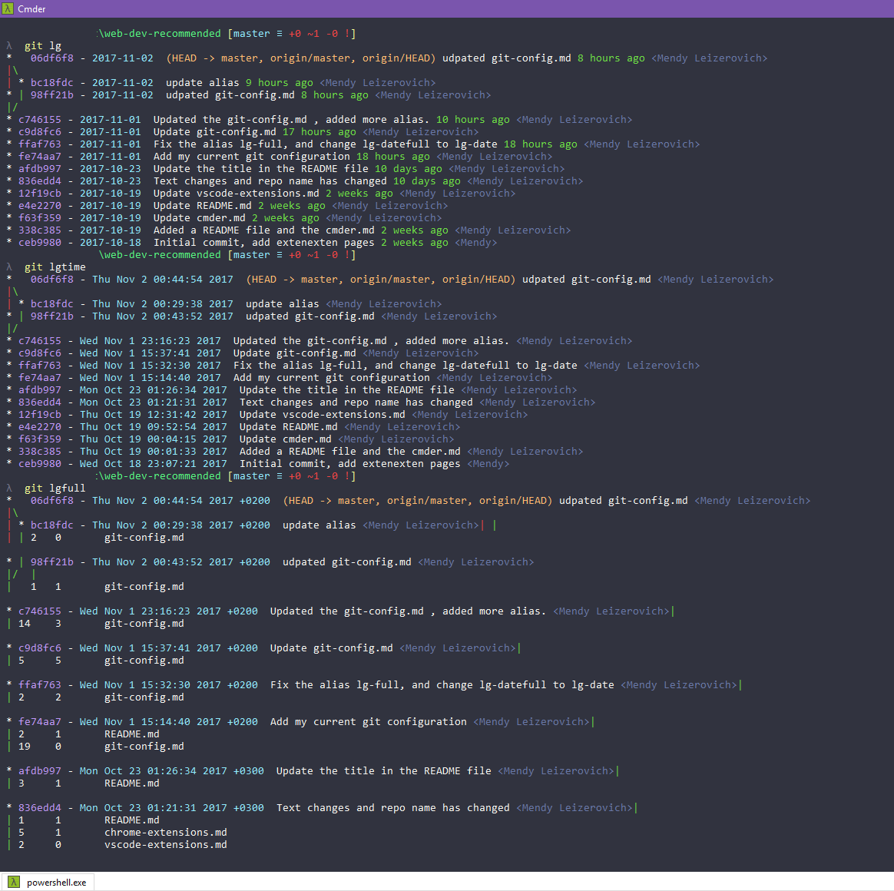

# Git Config

### Core

```
[core]
	editor = 'c:/program files (x86)/Notepad++/notepad++.exe' -multiInst -notabbar -nosession -noPlugin
```

### Alias

```
[alias]
	st = status
	sts = status -s
	ck = checkout
	ci = commit -m
	pulls = pull --autostash
	cpick = cherry-pick
	lg = log --graph --abbrev-commit --date=short --decorate --pretty=format:'%C(magenta)%h%C(reset) - %C(bold cyan)%ad%C(reset) %C(yellow)%d%C(reset) %s %C(green)%cr %C(bold blue)<%an>%C(reset)'
	lgfilter =  "!git lg --grep"
	lgs = log --graph --numstat --abbrev-commit --date=short --decorate --pretty=format:'%C(magenta)%h%C(reset) - %C(bold cyan)%ad%C(reset) %C(yellow)%d%C(reset) %s %C(green)%cr %C(bold blue)<%an>%C(reset)'
	lgci = log --date=short --pretty=format:' %C(yellow)%d%C(reset) - %C(bold cyan)%ad%C(reset) %s'
	lgtime = log --graph --date=local --abbrev-commit --decorate --pretty=format:'%C(magenta)%h%C(reset) - %C(bold cyan)%ad%C(reset) %C(yellow)%d%C(reset) %s %C(bold blue)<%an>%C(reset)'
	lgfull = log --graph --numstat --oneline --decorate --pretty=format:'%C(magenta)%h%C(reset) - %C(bold cyan)%ad%C(reset) %C(yellow)%d%C(reset) %s %C(bold blue)<%an>%C(reset)' --all
	lgshow = show
	last = "!git lg --numstat -1"
	lastf = "!git lg --numstat -5"
	lastfull = log --stat -1
	lastdiff = diff --cached HEAD^
	filelog = log -u
	files = log --name-only
	gconf-e = config --global -e
	gconf-l = config --global --list
	conf-e = config -e
	conf-l = config --list
	la = "!git config -l | grep alias | cut -c 7-"
	diff = diff --word-diff
	dc = diff --cached
	stf = "!git fetch; git status"
	cia = commit -am
	stash-c = stash clear
	stash-a = stash apply
	stash-s = stash show
	stash-full = "!git stash clear; git stash show; git stash;"
	change-msg = commit --amend
	reset-ci = reset --soft HEAD^
```

For example, here three of the log alias:



To add a single alias use this command:

```bash
git config --global alias.[THE_ALIAS] [THE_REAL_COMMAND]
```